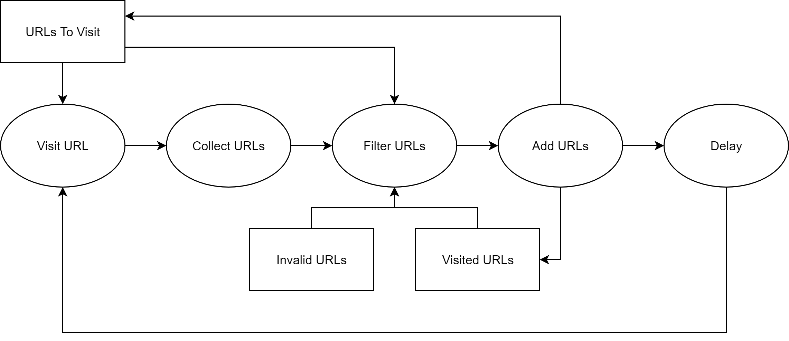

# Page Crawler

Node script to get all internal links to webpages of a given website

## Basic Program Flow

The diagram shows the basic program flow: At first, `URLs To Visit` contains the given base URL. The script requests the the last element added to the `URLs To Visit` and collects all anchor elements. After that, the collected links get filtered. Only URLs, which are:

1. internal and start with `/`
2. not on the `Visited URLs` or on the `To Visit` the list
3. not ending on
   - `.pdf`/`.pdf/`
   - `.jpg`/`.jpg/`
   - `.png`/`.png/`
   - `.svg`/`.svg/`
   - `.dotx`/`.dotx/`
   - `.risexport`

are relevant and are added to the `URLs To Visit` list. After that, the script waits for a defined amount of time to avoid to many requests to the server and starts to visit the next URL. This process ends, when the `URLs To Visit` is empty.
